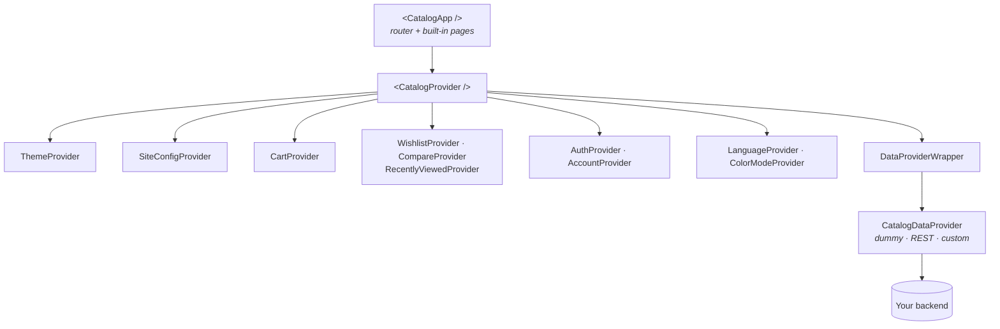
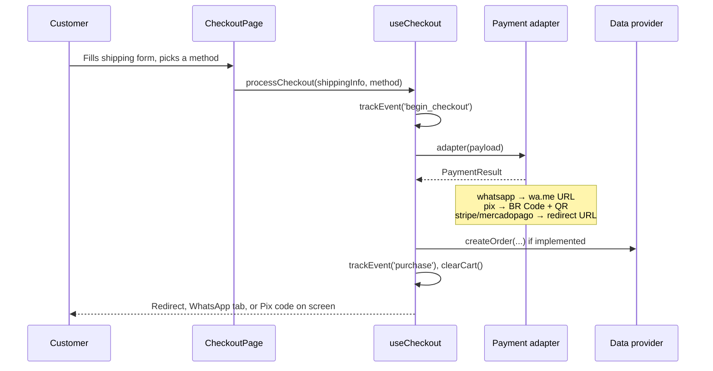

# How it works

<div className="ps-outcome">
<div className="ps-outcome-title">By the end of this page</div>

You will know which layer to reach for when you need to change something — and
which layer to leave alone.

</div>

## The layers

`CatalogApp` is a thin shell. It renders `CatalogProvider` plus a router with
the built-in pages. Everything of substance lives below it.



Read it as three questions:

1. **What does the store look like?** `ThemeProvider` — one of 50 themes or your
   own via `defineTheme`. See [Themes](./guides/themes.md).
2. **What does the store know about itself?** `SiteConfigProvider` — name,
   currency, WhatsApp number, Pix key, analytics IDs, coupons. See
   [Configuration](./guides/configuration.md).
3. **Where do the products come from?** `DataProviderWrapper` — the bundled demo
   data, your REST API, or any async functions you write. See
   [Data providers](./guides/data.md).

Everything else — cart, wishlist, comparison, recently viewed, auth, language,
color mode — is local state persisted to `localStorage`.

## Choosing your entry point

| You want to… | Use | What you give up |
|---|---|---|
| Ship a whole store now | `<CatalogApp />` | The page layouts are ours |
| Keep your own pages and routing | `<CatalogProvider />` + hooks | You build the UI |
| Use one piece in an existing app | Import the component directly | Contexts must still be in scope |

`CatalogApp` accepts the same props as `CatalogProvider` and forwards them:
`defaultTheme`, `customTheme`, `defaultLanguage`, `config`, `dataProvider`.

```tsx
// Turnkey
<CatalogApp defaultTheme="coffee" config={{ companyName: 'Roast & Beans' }} />

// Headless: same providers, your own tree
<CatalogProvider dataProvider={myProvider} config={{ companyName: 'Roast & Beans' }}>
  <MyHeader />
  <MyProductGrid />
</CatalogProvider>
```

## The checkout flow

Checkout is the part most projects need to change, so it is deliberately shallow:
one hook, and a swappable adapter per payment method.



An adapter is just `(payload: CheckoutPayload) => Promise<PaymentResult>`. To
integrate a PSP that PlugStore does not bundle, write that one function and pass
it to `useCheckout`. See [Checkout](./guides/checkout.md).

## Where state lives

Every provider persists to `localStorage` under a stable key, so a returning
visitor keeps their cart and their preferences:

| State | Provider | `localStorage` key |
|---|---|---|
| Selected theme | `ThemeProvider` | `ecom-template` (+ `ecom-template-default`) |
| Store settings | `SiteConfigProvider` | `ecom-site-config` |
| Cart | `CartProvider` | `ecom-cart` |
| Wishlist | `WishlistProvider` | `ecom-wishlist` |
| Comparison | `CompareProvider` | `ecom-compare` |
| Recently viewed | `RecentlyViewedProvider` | `ecom-recently-viewed` |
| Orders, addresses | `AccountProvider` | `ecom-orders`, `ecom-addresses` |
| Color mode | `ColorModeProvider` | `ecom-color-mode` |

This matters in one specific case: `defaultTheme` is an *initial* value. Once a
visitor has a theme stored, changing the prop alone does not move them — the
provider tracks which default produced the stored value and only overrides when
you actually change the prop. See [Themes](./guides/themes.md#defaulttheme-vs-stored-theme).

## Next

- [Create a project](./getting-started/cli.md)
- [Configure the store](./guides/configuration.md)
- [Connect your backend](./guides/data.md)
