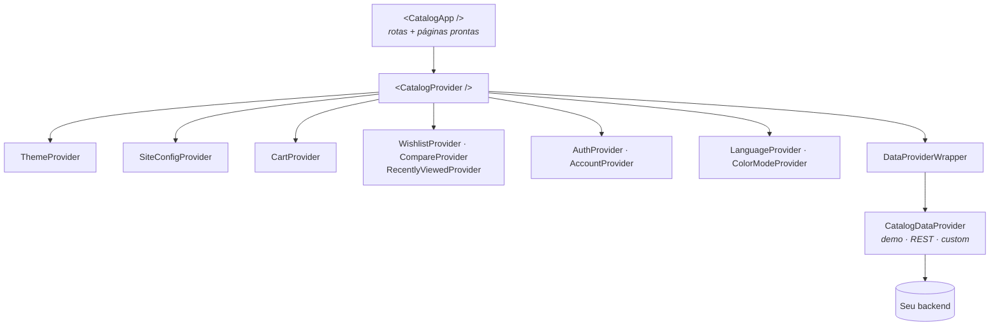
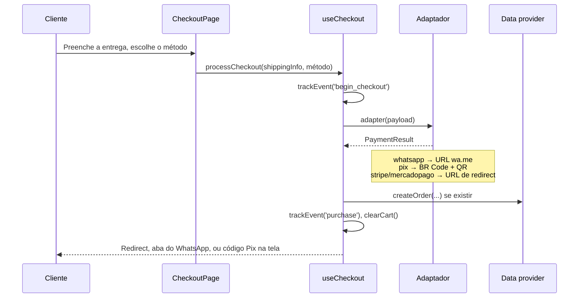

# Como funciona

<div className="ps-outcome">
<div className="ps-outcome-title">Ao final desta página</div>

Você vai saber em qual camada mexer quando precisar mudar algo — e qual camada
deixar quieta.

</div>

## As camadas

`CatalogApp` é uma casca fina. Ele renderiza o `CatalogProvider` mais um roteador
com as páginas prontas. Tudo que importa está abaixo dele.



Leia como três perguntas:

1. **Qual é a cara da loja?** `ThemeProvider` — um dos 50 temas ou o seu, via
   `defineTheme`. Veja [Temas](./guides/themes.md).
2. **O que a loja sabe sobre si mesma?** `SiteConfigProvider` — nome, moeda,
   WhatsApp, chave Pix, IDs de analytics, cupons. Veja
   [Configuração](./guides/configuration.md).
3. **De onde vêm os produtos?** `DataProviderWrapper` — os dados de
   demonstração, sua API REST, ou quaisquer funções assíncronas que você
   escrever. Veja [Data providers](./guides/data.md).

Todo o resto — carrinho, lista de desejos, comparador, vistos recentemente,
autenticação, idioma e modo de cor — é estado local persistido em
`localStorage`.

## Escolhendo o ponto de entrada

| Você quer… | Use | O que abre mão |
|---|---|---|
| Publicar uma loja inteira agora | `<CatalogApp />` | Os layouts das páginas são nossos |
| Manter suas páginas e suas rotas | `<CatalogProvider />` + hooks | Você constrói a interface |
| Usar uma peça em um app existente | Importar o componente direto | Os contextos ainda precisam estar acima |

`CatalogApp` aceita as mesmas props do `CatalogProvider` e repassa:
`defaultTheme`, `customTheme`, `defaultLanguage`, `config`, `dataProvider`.

```tsx
// Pronto para usar
<CatalogApp defaultTheme="coffee" config={{ companyName: 'Roast & Beans' }} />

// Headless: mesmos providers, sua própria árvore
<CatalogProvider dataProvider={meuProvider} config={{ companyName: 'Roast & Beans' }}>
  <MeuHeader />
  <MinhaGradeDeProdutos />
</CatalogProvider>
```

## O fluxo de checkout

Checkout é a parte que mais projetos precisam mudar, então é deliberadamente
rasa: um hook, e um adaptador trocável por método de pagamento.



Um adaptador é só `(payload: CheckoutPayload) => Promise<PaymentResult>`. Para
integrar um PSP que o PlugStore não traz, escreva essa função e passe para o
`useCheckout`. Veja [Checkout](./guides/checkout.md).

## Onde o estado mora

Todo provider persiste em `localStorage` com uma chave estável, para que quem
volta encontre o carrinho e as preferências:

| Estado | Provider | Chave no `localStorage` |
|---|---|---|
| Tema selecionado | `ThemeProvider` | `ecom-template` (+ `ecom-template-default`) |
| Configuração da loja | `SiteConfigProvider` | `ecom-site-config` |
| Carrinho | `CartProvider` | `ecom-cart` |
| Lista de desejos | `WishlistProvider` | `ecom-wishlist` |
| Comparação | `CompareProvider` | `ecom-compare` |
| Vistos recentemente | `RecentlyViewedProvider` | `ecom-recently-viewed` |
| Pedidos, endereços | `AccountProvider` | `ecom-orders`, `ecom-addresses` |
| Modo de cor | `ColorModeProvider` | `ecom-color-mode` |

Isso importa em um caso específico: `defaultTheme` é um valor *inicial*. Quando
alguém já tem um tema guardado, mudar a prop sozinha não move essa pessoa — o
provider registra qual default gerou o valor guardado e só sobrescreve quando
você de fato muda a prop. Veja
[Temas](./guides/themes.md#defaulttheme-vs-stored-theme).

## Próximos passos

- [Criar um projeto](./getting-started/cli.md)
- [Configurar a loja](./guides/configuration.md)
- [Conectar seu backend](./guides/data.md)
